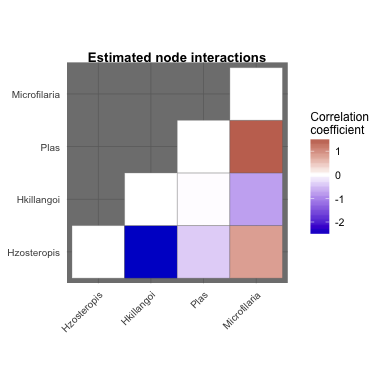
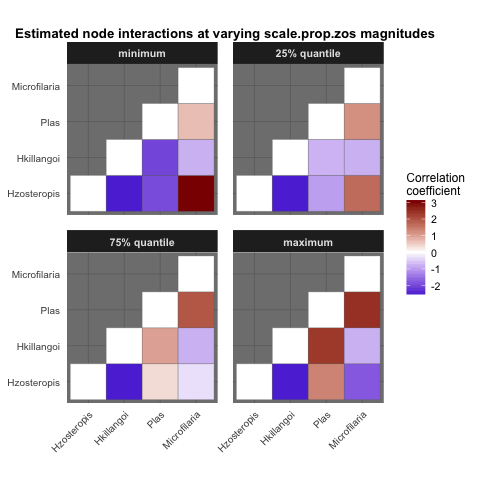

<!-- README.md is generated from README.Rmd. Please edit that file -->
Overview of `MRFcov`
--------------------

The `MRFcov` package provides functions for approximating node interaction parameters of undirected Markov Random Fields graphs. Models can incorporate covariates (following methods developed by Cheng **et al** 2014 and Lindberg 2016), allowing users to estimate how interactions between nodes in the graph are predicted to change across covariate gradients

Installation
------------

You can install `MRFcov` into `R` directly from `GitHub` using:

``` r
# install.packages("devtools")
devtools::install_github("nicholasjclark/MRFcov")
```

Usage
-----

Markov random fields interaction parameters are approximated using separate regressions for individual nodes (species) within a joint modelling framework. Because all combinations of covariates and additional nodes are included as predictor variables in regressions for each individual node, variable selection is required to reduce overfitting and add sparsity. This is accomplished through LASSO penalization using functions in the [penalized package](https://cran.r-project.org/web/packages/penalized/index.html)

Load the Bird.parasites dataset

``` r
data("Bird.parasites")
```

Run an MRF model using a single continuous covariate (scale.prop.zos). Here w and a weak penalization parameter (`lambda1`) for LASSO variable selection

``` r
MRF_mod <- MRFcov(data = Bird.parasites, n_nodes = 4, lambda1 = 1)
```

Plot the estimated species interaction coefficients

``` r
plotMRF_hm(MRF_mod = MRF_mod)
```



Visualise how species interactions change across covariate magnitudes

``` r
plotMRF_hm_cont(MRF_mod = MRF_mod, covariate = 'scale.prop.zos', data = Bird.parasites)
```



References
----------

Cheng, J., Levina, E., Wang, P. & Zhu, J. (2014). A sparse Ising model with covariates. Biometrics, 70, 943-953

Lindberg, O. (2016). Markov Random Fields in Cancer Mutation Dependencies. Master's of Science Thesis. University of Turku, Turku, Finland.
