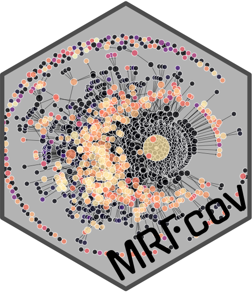
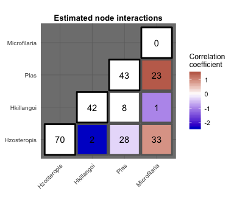

<!-- README.md is generated from README.Rmd. Please edit that file -->



# *MRFcov*: Markov Random Fields with additional covariates in R

[](https://zenodo.org/badge/latestdoi/116616159)[](https://github.com/nicholasjclark/MRFcov)

[Releases](https://github.com/nicholasjclark/MRFcov/releases)   |   [Reporting
Issues](https://github.com/nicholasjclark/MRFcov/issues)   |   [Application Blog]([http://nicholasjclark.weebly.com/biotic-interactions.html](https://communities.springernature.com/posts/winter-warming-has-larger-and-more-widespread-effects-on-fish-communities))


`MRFcov` (described by Clark *et al*, published in [*Ecology Statistical
Reports*](https://esajournals.onlinelibrary.wiley.com/doi/full/10.1002/ecy.2221))
provides `R` functions for approximating interaction parameters of nodes
in undirected Markov Random Fields (MRF) graphical networks. Models can
incorporate covariates (a class of models known as [Conditional Random
Fields;
CRFs](http://homepages.inf.ed.ac.uk/csutton/publications/crftut-fnt.pdf);
following methods developed by Cheng *et al* 2014 and Lindberg 2016),
allowing users to estimate how interactions between nodes are predicted
to change across covariate gradients. *Note, this is a development
version. For the stable version, please download from CRAN*

## Why Use Conditional Random Fields?

In principle, `MRFcov` models that use species’ occurrences or
abundances as outcome variables are similar to [Joint Species
Distribution
models](https://methodsblog.wordpress.com/2015/12/22/warton_ovaskainen/)
in that variance can be partitioned among abiotic and biotic effects.
However, key differences are that `MRFcov` models can:

1)  Produce directly interpretable coefficients that allow users to
    determine the relative importances (i.e. effect sizes) of biotic
    associations and environmental covariates in driving abundances or
    occurrence probabilities

2)  Identify association strengths, rather than simply determining
    whether they are “significantly different from zero”

3)  Estimate how associations are predicted to change across
    environmental gradients

Models such as these are also better at isolating true species
‘interactions’ using presence-absence occurrence data than are
traditional null model co-occurrence methods (such as the all-too-common
null model randomisation approaches). See [this
blogpost](https://rpubs.com/NickClark47/411878) for a more detailed
explanation and proof of this statement.

MRF and CRF interaction parameters are approximated using separate
regressions for individual species within a joint modelling framework.
Because all combinations of covariates and additional species are
included as predictor variables in node-specific regressions, variable
selection is required to reduce overfitting and add sparsity. This is
accomplished through LASSO penalization using functions in the
[glmnet](https://cran.r-project.org/web/packages/glmnet/index.html)
package.

## Installation

You can install the stable version of the `MRFcov` package into `R` from
[CRAN](https://cran.r-project.org/web/packages/MRFcov/index.html).
Alternatively, install the development version (updated features but no
gurantees of good functionality) from `GitHub` using:

``` r
# install.packages("devtools")
devtools::install_github("nicholasjclark/MRFcov")
```

## Brief Overview

We can explore the model’s primary functions using a test dataset that
is available with the package. Load the `Bird.parasites` dataset, which
contains binary occurrences of four avian blood parasites in New
Caledonian *Zosterops* species ([available in its original form at
Dryad](http://dx.doi.org/10.5061/dryad.pp6k4); Clark *et al* 2016). A
single continuous covariate is also included (`scale.prop.zos`), which
reflects the relative abundance of *Zosterops* species among different
sample sites

``` r
library(MRFcov)
data("Bird.parasites")
```

Visualise the dataset to see how analysis data needs to be structured.
In short, when estimating co-occurrence probabilities, node variable
(i.e. species) occurrences should be included as binary variables (1s
and 0s) as the left-most variables in `data`. Any covariates can be
included as the right-most variables. Note, these covariates should
ideally be on a similar scale, using the `scale` function for continuous
covariates (or similar) so that covariates generally have `mean = 0` and
`sd = 1`

``` r
help("Bird.parasites")
View(Bird.parasites)
```

You can read more about specific requirements of data formats (for
example, one-hot encoding of categorical covariates) in the supplied
vignette

``` r
vignette("CRF_data_prep")
```

### Running MRFs and visualising interaction coefficients

Run an MRF model using the provided continuous covariate
(`scale.prop.zos`). Here, each species-specific regression will be
individually optimised through cross-validated LASSO variable selection.
Corresponding coefficients (e.g. the coefficient for effect of species A
on species B and the coefficient for effect of species B on species A)
will be symmetrised to form an undirected MRF
graph

``` r
MRF_mod <- MRFcov(data = Bird.parasites, n_nodes = 4, family = 'binomial')
#> Leave-one-out cv used for the following low-occurrence (rare) nodes:
#>  Microfilaria ...
#> Fitting MRF models in sequence using 1 core ...
```

Visualise the estimated species interaction coefficients as a heatmap.
These represent mean interactions and are very useful for identifying
co-occurrence patterns, but they do not indicate how interactions change
across gradients. Note, for binary data such as this, we can also plot
the observed occurrences and co-occurrences using `plot_observed_vals =
TRUE`

``` r
plotMRF_hm(MRF_mod, plot_observed_vals = TRUE, data = Bird.parasites)
```

<!-- -->

### Exploring regression coefficients and interpreting results

We can explore regression coefficients to get a better understanding of
just how important interactions are for predicting species’ occurrence
probabilities (in comparison to other covariates). This is perhaps the
strongest property of conditional MRFs, as competing methods (such as
Joint Species Distribution Models) do not provide interpretable
mechanisms for comparing the relative importances of interactions and
fixed covariates. MRF functions conveniently return a matrix of
important coefficients for each node in the graph, as well as their
relative importances (calculated using the formula `B^2 / sum(B^2)`,
where the vector of `B`s represents regression coefficients for
predictor variables). Variables with an underscore (`_`) indicate an
interaction between a covariate and another node, suggesting that
conditional dependencies of the two nodes vary across environmental
gradients

``` r
MRF_mod$key_coefs$Hzosteropis
#>                      Variable Rel_importance Standardised_coef   Raw_coef
#> 1                  Hkillangoi     0.64623474        -2.3087824 -2.3087824
#> 5 scale.prop.zos_Microfilaria     0.12980415        -1.0347421 -1.0347421
#> 3                Microfilaria     0.10143149         0.9146907  0.9146907
#> 4              scale.prop.zos     0.09788426        -0.8985542 -0.8985542
#> 2                        Plas     0.01785290        -0.3837446 -0.3837446
```

``` r
MRF_mod$key_coefs$Hkillangoi
#>         Variable Rel_importance Standardised_coef   Raw_coef
#> 1    Hzosteropis     0.79853150        -2.3087824 -2.3087824
#> 2   Microfilaria     0.11897509        -0.8911791 -0.8911791
#> 3 scale.prop.zos     0.08154704        -0.7378041 -0.7378041
```

``` r
MRF_mod$key_coefs$Plas
#>                      Variable Rel_importance Standardised_coef   Raw_coef
#> 2                Microfilaria     0.63590587         1.8658732  1.8658732
#> 3              scale.prop.zos     0.24611774        -1.1607994 -1.1607994
#> 5 scale.prop.zos_Microfilaria     0.07969128         0.6605278  0.6605278
#> 1                 Hzosteropis     0.02689758        -0.3837446 -0.3837446
#> 4  scale.prop.zos_Hzosteropis     0.01023366        -0.2367016 -0.2367016
```

``` r
MRF_mod$key_coefs$Microfilaria
#>                     Variable Rel_importance Standardised_coef   Raw_coef
#> 3                       Plas      0.4423652         1.8658732  1.8658732
#> 4             scale.prop.zos      0.1589327        -1.1184028 -1.1184028
#> 5 scale.prop.zos_Hzosteropis      0.1360445        -1.0347421 -1.0347421
#> 1                Hzosteropis      0.1063078         0.9146907  0.9146907
#> 2                 Hkillangoi      0.1009129        -0.8911791 -0.8911791
#> 6        scale.prop.zos_Plas      0.0554369         0.6605278  0.6605278
```

To work through more in-depth tutorials and examples, see the vignettes
in the package and check out some of the recent papers that have been published using the
method

``` r
vignette("Bird_Parasite_CRF")
vignette("Gaussian_Poisson_CRFs")
```

Clark *et al* 2018
[*Ecology*](https://esajournals.onlinelibrary.wiley.com/doi/full/10.1002/ecy.2221)

Peel *et al* 2019 [*Emerging Microbes &
Infections*](https://www.tandfonline.com/doi/full/10.1080/22221751.2019.1661217?af=R)

Fountain-Jones *et al* 2019 [*Journal of Animal
Ecology*](https://besjournals.onlinelibrary.wiley.com/doi/abs/10.1111/1365-2656.13154)

Gallen *et al* 2019 [*Journal of Animal Ecology*](https://besjournals.onlinelibrary.wiley.com/doi/full/10.1111/1365-2656.13089)

Clark *et al* 2020 [*Transboundary and Emerging
Diseases*](https://onlinelibrary.wiley.com/doi/abs/10.1111/tbed.13565)

Clark *et al* 2020 [*Parasites &
Vectors*](https://parasitesandvectors.biomedcentral.com/articles/10.1186/s13071-020-04016-2)

Clark *et al* 2020 [*Nature Climate
Change*](https://www.nature.com/articles/s41558-020-0838-5)

Brian & Aldridge 2021 [*Journal of Animal Ecology*](https://besjournals.onlinelibrary.wiley.com/doi/full/10.1111/1365-2656.13436)

Sallam *et al* 2023 [*Parasites & Vectors*](https://link.springer.com/article/10.1186/s13071-022-05530-1)

## Key references

Cheng, J., Levina, E., Wang, P. & Zhu, J. (2014). A sparse Ising model
with covariates. *Biometrics* 70:943-953.

Clark, N.J., Wells, K., Lindberg, O. (2018). Unravelling changing
interspecific interactions across environmental gradients using Markov
random fields. *Ecology* DOI: <https://doi.org/10.1002/ecy.2221>

Clark, N.J., K. Wells, D. Dimitrov, and S.M. Clegg. (2016).
Co-infections and environmental conditions drive the distributions of
blood parasites in wild birds. *Journal of Animal Ecology* 85:1461-1470

Clark, N.J., S. Tozer, C. Wood, S.M. Firestone, M. Stevenson, C.
Caraguel, A.L. Chaber, J. Heller, R.J. Soares Magalhães. 2020.
Unravelling animal exposure profiles of human Q fever cases in
Queensland, Australia using natural language processing. *Transboundary
and Emerging Diseases* DOI: <https://doi.org/10.1111/tbed.13565>.

Clark, N.J., K. Owada, E. Ruberanziza, G. Ortu, I. Umulisa, U.
Bayisenge, J.B. Mbonigaba, J.B. Mucaca, W. Lancaster, A. Fenwick, R.J.
Soares Magalhães, A. Mbituyumuremyi. 2020. Parasite associations predict
infection risk: incorporating co-infections in predictive models for
neglected tropical diseases. *Parasites & Vectors* 13:1-16.

Clark, N.J., J.T. Kerry, C.I. Fraser. 2020. Rapid winter warming could
disrupt coastal marine fish community structure. *Nature Climate Change*
DOI: <https://doi.org/10.1038/s41558-020-0838-5>

Fountain‐Jones, N.M., N.J. Clark, A.C. Kinsley, M. Carstensen, J.
Forester, T.J. Johnson, E. Miller, S. Moore, T.M. Wolf, M.E. Craft.
2019. Microbial associations and spatial proximity predict North
American moose (*Alces alces*) gastrointestinal community composition.
*Journal of Animal Ecology* 89:817-828.

Lindberg, O. (2016). Markov Random Fields in Cancer Mutation
Dependencies. Master’s of Science Thesis. University of Turku, Turku,
Finland.

Peel, A.J., K. Wells, J. Giles, V. Boyd, A. Burroughs, D. Edson, G.
Crameri, M. L. Baker, H. Field, L-F. Wang, H. McCallum, R. K. Plowright,
N. Clark. 2019. Synchronous shedding of multiple bat paramyxoviruses
coincides with peak periods of Hendra virus spillover. *Emerging
Microbes & Infections* 8:1314-1323

*This project is licensed under the terms of the GNU General Public
License (GNU GPLv3)*
