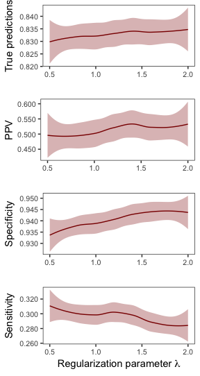
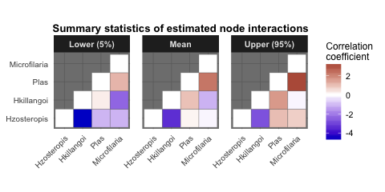

<!-- README.md is generated from README.Rmd. Please edit that file -->
Overview
--------

The `MRFcov` package (described by Clark et al, *in press in Ecology Statistical Reports*) provides functions for approximating interaction parameters of nodes in undirected Markov Random Fields (MRF) graphs. Models can incorporate covariates (a class of models known as [Conditional Markov Random Fields; CRFs](http://homepages.inf.ed.ac.uk/csutton/publications/crftut-fnt.pdf); following methods developed by Cheng *et al* 2014 and Lindberg 2016), allowing users to estimate how interactions between nodes in the graph are predicted to change across covariate gradients.

In principle, `MRFcov` models that use species' occurrences as outcome variables are similar to joint species distribution models in that variance in occurrences can be partitioned among abiotic and biotic drivers. However, key differences are that `MRFCov` models can:
(1) Produce directly interpretable coefficients that allow users to determine the relative importances (i.e. effect sizes) of species' interactions and environmental covariates in driving occurrence probabilities
(2) Identify interaction strengths, rather than simply determining whether they are "significantly different from zero"
(3) Estimate how interactions are predicted to change across environmental gradients

At present, only binary response variables can be included (1s and 0s), though models accomodating different data structures may be added in future.

MRF and CRF interaction parameters are approximated using separate regressions for individual species within a joint modelling framework. Because all combinations of covariates and additional species are included as predictor variables in node-specific regressions, variable selection is required to reduce overfitting and add sparsity. This is accomplished through LASSO penalization using functions in the [penalized](https://cran.r-project.org/web/packages/penalized/index.html) package.

*This project is licensed under the terms of the GNU General Public License (GNU GPLv3)*

Installation
------------

You can install the `MRFcov` package into `R` directly from `GitHub` using:

``` r
# install.packages("devtools")
devtools::install_github("nicholasjclark/MRFcov")
```

Usage
-----

We can explore the model's primary functions using a test dataset that is available with the package. Load the `Bird.parasites` dataset, which contains binary occurrences of four avian blood parasites in New Caledonian *Zosterops* species ([available in its original form at Dryad](http://dx.doi.org/10.5061/dryad.pp6k4); Clark *et al* 2016). A single continuous covariate is also included (`scale.prop.zos`), which reflects the relative abundance of *Zosterops* species among different sample sites

``` r
library(MRFcov)
data("Bird.parasites")
```

Visualise the dataset to see how analysis data needs to be structured. In short, node variable (i.e. species) occurrences should be included as binary variables (1s and 0s) as the left-most variables in `data`. Any covariates can be included as the right-most variables. Note, these covariates should all be on a similar scale, ideally using the `scale` function for continuous covariates (or similar) so that covariates have `mean = 0` and `sd = 1`

``` r
help("Bird.parasites")
View(Bird.parasites)
```

### Running MRFs and visualising interaction coefficients

Run an MRF model using the provided continuous covariate (`scale.prop.zos`). Here we specify a weak penalization parameter (`lambda1`) for the LASSO variable selection as we only have a single covariate

``` r
MRF_mod <- MRFcov(data = Bird.parasites, n_nodes = 4, lambda1 = 0.5)
```

Visualise the estimated species interaction coefficients as a heatmap

``` r
plotMRF_hm(MRF_mod = MRF_mod)
```


Visualise how species interactions are predicted to change across covariate magnitudes

``` r
plotMRF_hm_cont(MRF_mod = MRF_mod, covariate = 'scale.prop.zos', data = Bird.parasites, 
                main = 'Estimated interactions across host relative densities')
```


### Choosing penalization parameters

Choosing the appropriate `lambda1` value often requires exploration of model predictive performance at different values. The function `cv_MRF_diag` uses cross-validation to examine how well models fitted with training datasets can predict observations that have been with-held from the data (test datasets) at different `lambda1` values. We also have the option of specifying `lambda2`, where values `>0` lead to more effective shrinkage of coefficients (sometimes this is necessary for large datasets with many potential predictors; see documentation in the `penalized` package for more details). Given the large number of models that may be required during cross-validation or bootstrapping (see below), we can use parallel computation by relying on functions in the [parallel](https://www.google.com.au/url?sa=t&rct=j&q=&esrc=s&source=web&cd=2&cad=rja&uact=8&ved=0ahUKEwj6iZyPvcnYAhVLvrwKHaJ9AhUQFgg2MAE&url=https%3A%2F%2Fstat.ethz.ch%2FR-manual%2FR-devel%2Flibrary%2Fparallel%2Fdoc%2Fparallel.pdf&usg=AOvVaw2eR83aL93jttPIS-mLWzEL) package. The number of worker clusters to split the job across can be specified using the `n_cores` argument

``` r
cv_MRF_diag(data = Bird.parasites, min_lambda1 = 0.4, max_lambda1 = 2, by_lambda1 = 0.1, n_nodes = 4, n_cores = 3)
```



    #> TableGrob (4 x 1) "arrange": 4 grobs
    #>   z     cells    name           grob
    #> 1 1 (1-1,1-1) arrange gtable[layout]
    #> 2 2 (2-2,1-1) arrange gtable[layout]
    #> 3 3 (3-3,1-1) arrange gtable[layout]
    #> 4 4 (4-4,1-1) arrange gtable[layout]

### Bootstrapping the data and running models across a range of penalization values

Here, `lambda1` values between 0.5 and 1.5 maintain reasonable **Sensitivity** (which represents the proportion of true positives that are correctly predicted). Because we are using rather rare parasite occurrences (prevalence of these parasites is fairly low), it is in our interest to use models that can maintain **Sensitivity**, as long as we are not at risk of overfitting (in this case, our maximum number of predictors is not very high, given that we only have four species and one covariate). Now that we have identified a suitable range of `lambda1` values, we can fit models to bootstrapped subsets of the data within this range to account for uncertainty.

``` r
booted_MRF <- bootstrap_MRF(data = Bird.parasites, n_nodes = 4, n_bootstraps = 50, min_lambda1 = 0.5, max_lambda1 = 1.5, by_lambda1 = 0.1, n_cores = 3)
```

Now we can visualise confidence intervals of interaction coefficients that were estimated across the full range of models

``` r
plotMRF_hm(MRF_mod = booted_MRF, plot_booted_coefs = TRUE)
```



### Exploring regression coefficients and interpreting results

Finally, we can explore regression coefficients to get a better understanding of just how important interactions are for predicting species' occurrence probabilities (in comparison to other covariates). This is perhaps the strongest property of conditional MRFs, as competing methods (such as Joint Species Distribution Models) do not provide interpretable mechanisms for comparing the relative importances of interactions and fixed covariates. The `bootstrap_MRF` function conveniently returns a matrix of important coefficients for each node in the graph, as well as their relative importances (calculated using the formula `B^2 / sum(B^2)`, where the vector of `B`s represents regression coefficients for predictor variables). Variables with an underscore (`_`) indicate an interaction between a covariate and another node, suggesting that conditional dependencies of the two nodes vary across environmental gradients

``` r
booted_MRF$mean_key_coefs$Hzosteropis
#>                      Variable Rel_importance  Mean_coef
#> 1                  Hkillangoi     0.65485599 -3.2171194
#> 7 scale.prop.zos_Microfilaria     0.13615192 -1.4669191
#> 3                Microfilaria     0.06938063  1.0471609
#> 4              scale.prop.zos     0.06348516 -1.0016832
#> 6         scale.prop.zos_Plas     0.03694145  0.7641018
#> 2                        Plas     0.02223116 -0.5927552
#> 5   scale.prop.zos_Hkillangoi     0.01695370 -0.5176384
```

``` r
booted_MRF$mean_key_coefs$Hkillangoi
#>                     Variable Rel_importance  Mean_coef
#> 1                Hzosteropis     0.73480375 -3.2171194
#> 5        scale.prop.zos_Plas     0.09961422  1.1845194
#> 2               Microfilaria     0.07618718 -1.0359110
#> 3             scale.prop.zos     0.06119444 -0.9284050
#> 4 scale.prop.zos_Hzosteropis     0.01902348 -0.5176384
```

``` r
booted_MRF$mean_key_coefs$Plas
#>                      Variable Rel_importance  Mean_coef
#> 3                Microfilaria     0.45126587  1.9326321
#> 6   scale.prop.zos_Hkillangoi     0.16951903  1.1845194
#> 4              scale.prop.zos     0.15886492 -1.1466925
#> 7 scale.prop.zos_Microfilaria     0.09374872  0.8808777
#> 5  scale.prop.zos_Hzosteropis     0.07054018  0.7641018
#> 1                 Hzosteropis     0.04245070 -0.5927552
#> 2                  Hkillangoi     0.01361058 -0.3356381
```

``` r
booted_MRF$mean_key_coefs$Microfilaria
#>                     Variable Rel_importance  Mean_coef
#> 3                       Plas     0.36984178  1.9326321
#> 5 scale.prop.zos_Hzosteropis     0.21307374 -1.4669191
#> 4             scale.prop.zos     0.12377015 -1.1180190
#> 1                Hzosteropis     0.10857864  1.0471609
#> 2                 Hkillangoi     0.10625820 -1.0359110
#> 6        scale.prop.zos_Plas     0.07683318  0.8808777
```

References
----------

Cheng, J., Levina, E., Wang, P. & Zhu, J. (2014). A sparse Ising model with covariates. *Biometrics* 70:943-953.

Clark, N.J., Wells, K., Lindberg, O. (2018). Unravelling changing interspecific interactions across environmental gradients using Markov random fields. *Ecology* (accepted 02/03/18)

Clark, N.J., K. Wells, D. Dimitrov, and S.M. Clegg. (2016). Co-infections and environmental conditions drive the distributions of blood parasites in wild birds. *Journal of Animal Ecology* 85:1461-1470.

Lindberg, O. (2016). Markov Random Fields in Cancer Mutation Dependencies. Master's of Science Thesis. University of Turku, Turku, Finland.
